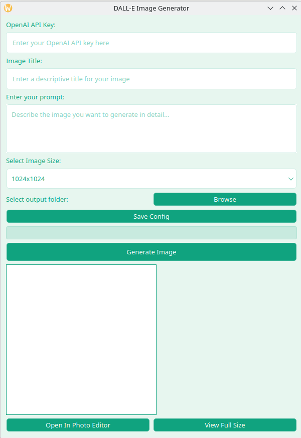
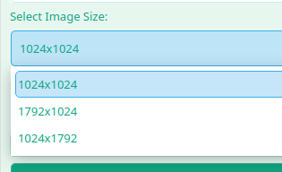
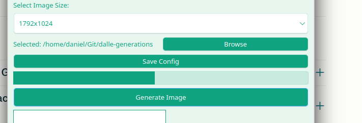
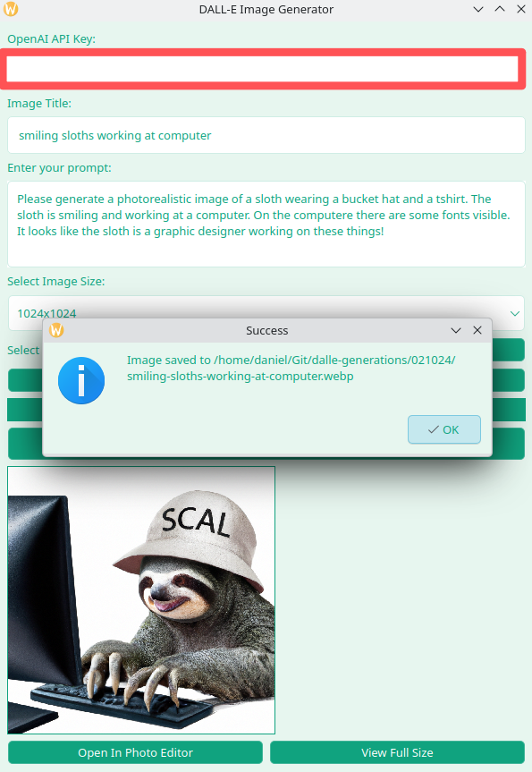
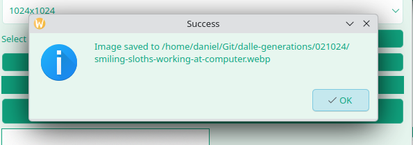
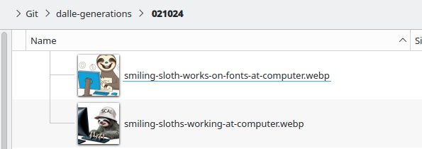
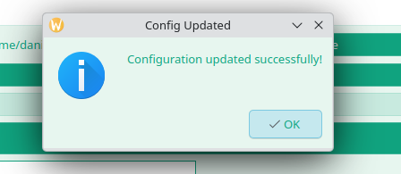
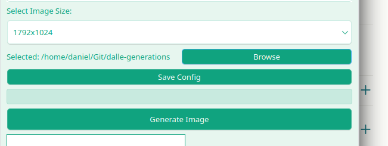

# Prompt 1 Defining Specs To GPT 4o

Please generate an impressive and nicely designed GUI for generating images from prompts in a repo. 

My openAI key is OPENAI_KEY in the dot env file

The GUI should allow the user to specify a title for the image and a prompt and a size that the image should be in pixels 

The user should also be able to specify where the generated image should be stored in their OS 

his setting should persist through reboots, so it will be to be saved into some kind of non-volatile storage 

Once the user has entered the prompt and any other parameters that they might wish to adjust, the generation request is sent to the DALLE API 

The file should be saved into a subfolder immediately within the output directory that the user specified. 

The subfolder should be in the format ddmmyy. 

If it does not already exist, it should be created 

he file name is the title that the user configured If the user chose a title "Smiling sloth at computer" the file name would be smiling-sloth-at-computer.webp 

The GUI should be nicely designed with clear buttons and a bright UI

---

# Output 1 By GPT-4 Omni

Here's a Python script using PyQt6 to create an impressive and nicely designed GUI for generating images from prompts using the DALL-E API. This script allows users to specify a title, prompt, image size, and output directory. The settings persist through reboots using `QSettings`.

```python
import sys
import os
import requests
from datetime import datetime
from PyQt6.QtWidgets import (QApplication, QWidget, QVBoxLayout, QLabel, 
                             QLineEdit, QPushButton, QFileDialog, QMessageBox,
                             QComboBox)
from PyQt6.QtGui import QIcon
from PyQt6.QtCore import Qt, QSettings
from dotenv import load_dotenv
import openai

# Load the OpenAI API key from the .env file
load_dotenv()
api_key = os.getenv('OPENAI_KEY')
openai.api_key = api_key

class DalleImageGenerator(QWidget):
    def __init__(self):
        super().__init__()
        self.initUI()
        
    def initUI(self):
        self.setWindowTitle('DALL-E Image Generator')
        self.setGeometry(100, 100, 500, 300)
        self.setStyleSheet("background-color: #f0f8ff;")  # Light blue background

        layout = QVBoxLayout()
        
        # Title input
        title_label = QLabel('Image Title:')
        self.title_input = QLineEdit()
        layout.addWidget(title_label)
        layout.addWidget(self.title_input)
        
        # Prompt input
        prompt_label = QLabel('Enter your prompt:')
        self.prompt_input = QLineEdit()
        layout.addWidget(prompt_label)
        layout.addWidget(self.prompt_input)
        
        # Size selection
        size_label = QLabel('Select Image Size:')
        self.size_combo = QComboBox()
        self.size_combo.addItems(["256x256", "512x512", "1024x1024"])
        layout.addWidget(size_label)
        layout.addWidget(self.size_combo)

        # Output folder selection
        folder_layout = QVBoxLayout()
        self.folder_label = QLabel('Select output folder:')
        self.folder_button = QPushButton('Browse')
        self.folder_button.clicked.connect(self.select_folder)
        folder_layout.addWidget(self.folder_label)
        folder_layout.addWidget(self.folder_button)
        layout.addLayout(folder_layout)

        # Generate button
        generate_button = QPushButton('Generate Image')
        generate_button.setStyleSheet('background-color: #4682b4; color: white;')  # Steel blue button
        generate_button.clicked.connect(self.generate_image)
        layout.addWidget(generate_button)

        self.setLayout(layout)

        # Load saved settings
        self.settings = QSettings('DalleImageGenerator', 'Settings')
        self.load_settings()

    def select_folder(self):
        folder = QFileDialog.getExistingDirectory(self, "Select Directory")
        if folder:
            self.folder_label.setText(f'Selected: {folder}')
            self.settings.setValue('output_folder', folder)

    def load_settings(self):
        output_folder = self.settings.value('output_folder', '')
        
        if output_folder:
            self.folder_label.setText(f'Selected: {output_folder}')

    def save_settings(self):
        self.settings.setValue('output_folder', self.settings.value('output_folder', ''))

    def generate_image(self):
        title = self.title_input.text().strip().replace(" ", "-").lower()
        prompt = self.prompt_input.text().strip()
        
        if not title or not prompt:
            QMessageBox.warning(self, 'Error', 'Please enter both a title and a prompt.')
            return
        
        size = self.size_combo.currentText()
        
        try:
            # Call the DALL-E API to generate an image
            response = openai.Image.create(
                prompt=prompt,
                n=1,
                size=size
            )
            
            image_url = response['data'][0]['url']
            
            # Create the directory structure if it doesn't exist
            today = datetime.now().strftime('%d%m%y')
            output_folder = self.settings.value('output_folder', '')
            save_path = os.path.join(output_folder, today)
            os.makedirs(save_path, exist_ok=True)
            
            # Download and save the image
            image_response = requests.get(image_url)
            image_path = os.path.join(save_path, f'{title}.webp')
            
            with open(image_path, 'wb') as f:
                f.write(image_response.content)
            
            QMessageBox.information(self, 'Success', f'Image saved to {image_path}')
            self.close()
            
        except Exception as e:
            QMessageBox.critical(self, 'Error', f'An error occurred: {str(e)}')

if __name__ == '__main__':
    app = QApplication(sys.argv)
    app.setWindowIcon(QIcon())  # Add your icon here if available
    ex = DalleImageGenerator()
    ex.show()
    sys.exit(app.exec())
```

### Key Features:

- **User Inputs:** Allows users to specify an image title, prompt, and size.
- **Output Directory:** Users can select an output directory for saving images. This setting persists through reboots using `QSettings`.
- **Folder Structure:** Images are saved in `/generations/ddmmyy` format within the specified output directory.
- **File Naming:** The file name is based on the user-provided title (converted to lowercase and spaces replaced with hyphens).
- **Bright UI:** The interface uses a light blue background with steel blue buttons for a modern look.

### Setup Instructions:

1. **Install Required Packages:**
   Ensure you have these packages installed:

   ```bash
   pip install pyqt6 openai python-dotenv requests
   ```

2. **Create a `.env` File:**
   Place your OpenAI API key in a `.env` file in the same directory as the script:

   ```
   OPENAI_KEY=your_openai_api_key_here
   ```

3. **Run the Script:**
   Execute the script to launch the GUI and start generating images.

This GUI provides a user-friendly interface for generating images with DALL-E while managing settings efficiently.

---

# Prompt 2

Is it not possible to choose a custom image size when using the API? I see that you've decided to allow 3 variables, but in most cases I'd like to specify a custom size. If it's possible, the user should be able to choose a custom size rather than any variables. If that's not a possible feature, remove the selection functionality from the UI altogether

---

# Output 2 - GPT4o Mini

Based on the information from the search results, DALL-E 3 currently supports three predefined image sizes: 1024x1024, 1792x1024, and 1024x1792 pixels[1][2][3]. Custom image sizes are not supported directly through the API. Therefore, you should remove the custom size selection functionality from the UI and instead provide a dropdown with these three options.

Here's how you can update the GUI to reflect this:

```python
import sys
import os
import requests
from datetime import datetime
from PyQt6.QtWidgets import (QApplication, QWidget, QVBoxLayout, QLabel, 
                             QLineEdit, QPushButton, QFileDialog, QMessageBox,
                             QComboBox)
from PyQt6.QtGui import QIcon
from PyQt6.QtCore import Qt, QSettings
from dotenv import load_dotenv
import openai

# Load the OpenAI API key from the .env file
load_dotenv()
api_key = os.getenv('OPENAI_KEY')
openai.api_key = api_key

class DalleImageGenerator(QWidget):
    def __init__(self):
        super().__init__()
        self.initUI()
        
    def initUI(self):
        self.setWindowTitle('DALL-E Image Generator')
        self.setGeometry(100, 100, 500, 300)
        self.setStyleSheet("background-color: #f0f8ff;")  # Light blue background

        layout = QVBoxLayout()
        
        # Title input
        title_label = QLabel('Image Title:')
        self.title_input = QLineEdit()
        layout.addWidget(title_label)
        layout.addWidget(self.title_input)
        
        # Prompt input
        prompt_label = QLabel('Enter your prompt:')
        self.prompt_input = QLineEdit()
        layout.addWidget(prompt_label)
        layout.addWidget(self.prompt_input)
        
        # Size selection
        size_label = QLabel('Select Image Size:')
        self.size_combo = QComboBox()
        self.size_combo.addItems(["1024x1024", "1792x1024", "1024x1792"])
        layout.addWidget(size_label)
        layout.addWidget(self.size_combo)

        # Output folder selection
        folder_layout = QVBoxLayout()
        self.folder_label = QLabel('Select output folder:')
        self.folder_button = QPushButton('Browse')
        self.folder_button.clicked.connect(self.select_folder)
        folder_layout.addWidget(self.folder_label)
        folder_layout.addWidget(self.folder_button)
        layout.addLayout(folder_layout)

        # Generate button
        generate_button = QPushButton('Generate Image')
        generate_button.setStyleSheet('background-color: #4682b4; color: white;')  # Steel blue button
        generate_button.clicked.connect(self.generate_image)
        layout.addWidget(generate_button)

        self.setLayout(layout)

        # Load saved settings
        self.settings = QSettings('DalleImageGenerator', 'Settings')
        self.load_settings()

    def select_folder(self):
        folder = QFileDialog.getExistingDirectory(self, "Select Directory")
        if folder:
            self.folder_label.setText(f'Selected: {folder}')
            self.settings.setValue('output_folder', folder)

    def load_settings(self):
        output_folder = self.settings.value('output_folder', '')
        
        if output_folder:
            self.folder_label.setText(f'Selected: {output_folder}')

    def save_settings(self):
        self.settings.setValue('output_folder', self.settings.value('output_folder', ''))

    def generate_image(self):
        title = self.title_input.text().strip().replace(" ", "-").lower()
        prompt = self.prompt_input.text().strip()
        
        if not title or not prompt:
            QMessageBox.warning(self, 'Error', 'Please enter both a title and a prompt.')
            return
        
        size = self.size_combo.currentText()
        
        try:
            # Call the DALL-E API to generate an image
            response = openai.Image.create(
                prompt=prompt,
                n=1,
                size=size
            )
            
            image_url = response['data'][0]['url']
            
            # Create the directory structure if it doesn't exist
            today = datetime.now().strftime('%d%m%y')
            output_folder = self.settings.value('output_folder', '')
            save_path = os.path.join(output_folder, today)
            os.makedirs(save_path, exist_ok=True)
            
            # Download and save the image
            image_response = requests.get(image_url)
            image_path = os.path.join(save_path, f'{title}.webp')
            
            with open(image_path, 'wb') as f:
                f.write(image_response.content)
            
            QMessageBox.information(self, 'Success', f'Image saved to {image_path}')
            self.close()
            
        except Exception as e:
            QMessageBox.critical(self, 'Error', f'An error occurred: {str(e)}')

if __name__ == '__main__':
    app = QApplication(sys.argv)
    app.setWindowIcon(QIcon())  # Add your icon here if available
    ex = DalleImageGenerator()
    ex.show()
    sys.exit(app.exec())
```

### Key Changes:

- **Size Selection:** The size selection is now limited to the three available options: 1024x1024, 1792x1024, and 1024x1792 pixels.
- **Removed Custom Size Input:** Since custom sizes are not supported by the API, this option has been removed from the UI.

This updated script maintains a user-friendly interface while adhering to the constraints of the DALL-E API.

Citations:
[1] https://webleveling.com/content-management/how-to-get-different-image-sizes-in-dalle-3/
[2] https://cookbook.openai.com/articles/what_is_new_with_dalle_3
[3] https://platform.openai.com/docs/guides/images

---

# Prompt 3

Please add to the UI the ability to provide an open AI API key. once provided it should be saved in persistent storage along with the preferred output folder. there should be a save config button to allow the user to update these parameters from time to time and a "Config updated! success message when the configuration update is applied

---

Certainly! Here's an updated version of the script that includes the ability to input and save the OpenAI API key along with the preferred output folder. The configuration is saved using `QSettings` for persistence, and a "Config updated!" success message is displayed when the configuration is updated.

```python
import sys
import os
import requests
from datetime import datetime
from PyQt6.QtWidgets import (QApplication, QWidget, QVBoxLayout, QLabel, 
                             QLineEdit, QPushButton, QFileDialog, QMessageBox,
                             QComboBox)
from PyQt6.QtGui import QIcon
from PyQt6.QtCore import Qt, QSettings
import openai

class DalleImageGenerator(QWidget):
    def __init__(self):
        super().__init__()
        self.initUI()
        
    def initUI(self):
        self.setWindowTitle('DALL-E Image Generator')
        self.setGeometry(100, 100, 500, 400)
        self.setStyleSheet("background-color: #f0f8ff;")  # Light blue background

        layout = QVBoxLayout()
        
        # API Key input
        api_key_label = QLabel('OpenAI API Key:')
        self.api_key_input = QLineEdit()
        layout.addWidget(api_key_label)
        layout.addWidget(self.api_key_input)

        # Title input
        title_label = QLabel('Image Title:')
        self.title_input = QLineEdit()
        layout.addWidget(title_label)
        layout.addWidget(self.title_input)
        
        # Prompt input
        prompt_label = QLabel('Enter your prompt:')
        self.prompt_input = QLineEdit()
        layout.addWidget(prompt_label)
        layout.addWidget(self.prompt_input)
        
        # Size selection
        size_label = QLabel('Select Image Size:')
        self.size_combo = QComboBox()
        self.size_combo.addItems(["1024x1024", "1792x1024", "1024x1792"])
        layout.addWidget(size_label)
        layout.addWidget(self.size_combo)

        # Output folder selection
        folder_layout = QVBoxLayout()
        self.folder_label = QLabel('Select output folder:')
        self.folder_button = QPushButton('Browse')
        self.folder_button.clicked.connect(self.select_folder)
        folder_layout.addWidget(self.folder_label)
        folder_layout.addWidget(self.folder_button)
        layout.addLayout(folder_layout)

        # Save config button
        save_config_button = QPushButton('Save Config')
        save_config_button.setStyleSheet('background-color: #4682b4; color: white;')  # Steel blue button
        save_config_button.clicked.connect(self.save_settings)
        layout.addWidget(save_config_button)

        # Generate button
        generate_button = QPushButton('Generate Image')
        generate_button.setStyleSheet('background-color: #4682b4; color: white;')  # Steel blue button
        generate_button.clicked.connect(self.generate_image)
        layout.addWidget(generate_button)

        self.setLayout(layout)

        # Load saved settings
        self.settings = QSettings('DalleImageGenerator', 'Settings')
        self.load_settings()

    def select_folder(self):
        folder = QFileDialog.getExistingDirectory(self, "Select Directory")
        if folder:
            self.folder_label.setText(f'Selected: {folder}')
            self.settings.setValue('output_folder', folder)

    def load_settings(self):
        api_key = self.settings.value('api_key', '')
        output_folder = self.settings.value('output_folder', '')
        
        if api_key:
            self.api_key_input.setText(api_key)
            
        if output_folder:
            self.folder_label.setText(f'Selected: {output_folder}')

    def save_settings(self):
        api_key = self.api_key_input.text().strip()
        
        if not api_key:
            QMessageBox.warning(self, 'Error', 'Please enter your OpenAI API key.')
            return

        self.settings.setValue('api_key', api_key)
        
        QMessageBox.information(self, 'Config Updated', 'Configuration updated successfully!')

    def generate_image(self):
        title = self.title_input.text().strip().replace(" ", "-").lower()
        prompt = self.prompt_input.text().strip()
        
        if not title or not prompt:
            QMessageBox.warning(self, 'Error', 'Please enter both a title and a prompt.')
            return
        
        size = self.size_combo.currentText()
        
        try:
            openai.api_key = self.settings.value('api_key', '')
            
            if not openai.api_key:
                QMessageBox.warning(self, 'Error', 'OpenAI API key is missing. Please update your configuration.')
                return

            # Call the DALL-E API to generate an image
            response = openai.Image.create(
                prompt=prompt,
                n=1,
                size=size
            )
            
            image_url = response['data'][0]['url']
            
            # Create the directory structure if it doesn't exist
            today = datetime.now().strftime('%d%m%y')
            output_folder = self.settings.value('output_folder', '')
            save_path = os.path.join(output_folder, today)
            os.makedirs(save_path, exist_ok=True)
            
            # Download and save the image
            image_response = requests.get(image_url)
            image_path = os.path.join(save_path, f'{title}.webp')
            
            with open(image_path, 'wb') as f:
                f.write(image_response.content)
            
            QMessageBox.information(self, 'Success', f'Image saved to {image_path}')
            
            # Optionally close the application after success
            # self.close()
            
        except Exception as e:
            QMessageBox.critical(self, 'Error', f'An error occurred: {str(e)}')

if __name__ == '__main__':
    app = QApplication(sys.argv)
    app.setWindowIcon(QIcon())  # Add your icon here if available
    ex = DalleImageGenerator()
    ex.show()
    sys.exit(app.exec())
```

### Key Features:

- **API Key Input:** Users can input their OpenAI API key directly into the GUI.
- **Persistent Storage:** Both the API key and output folder are stored using `QSettings`, ensuring they persist through reboots.
- **Save Config Button:** A button allows users to save their configuration settings. A success message confirms when settings are updated.
- **Generate Button:** Generates images based on user input and saves them in a structured format.

### Setup Instructions:

1. **Install Required Packages:**
   Ensure you have these packages installed:

   ```bash
   pip install pyqt6 openai requests python-dotenv
   ```

2. **Run the Script:**
   Execute the script to launch the GUI and start generating images.

This setup provides a complete solution for managing configurations and generating images with DALL-E through an intuitive interface.

---

# Prompt 4 - Claude

Hi Claude. Please find attached a Python GUI that needs some debugging with the indentation. You can probably guess its purpose: it's to provide a simple GUI to allow the user run prompts for DALLE over the openAI API. It then saves them into a specified folder which the user can share.

In addition to the debugging, please make sure that the persistent storage is somewhere outside of the repo as I might choose to share this publicly at some point and I don't want to share my credentials (obviously).

Play around with the UI and color scheme too. It could use a lot of improvement. The green scheme that DALLE itself uses is nice and should be integrated.

Return the whole script in one code block without any comments. Validate it before returning it to me to make sure that it's valid executable Python that is free of errors.

---

## Screenshots Of GUI Developed, Output 4
















